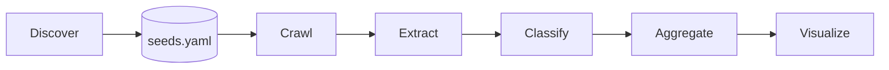
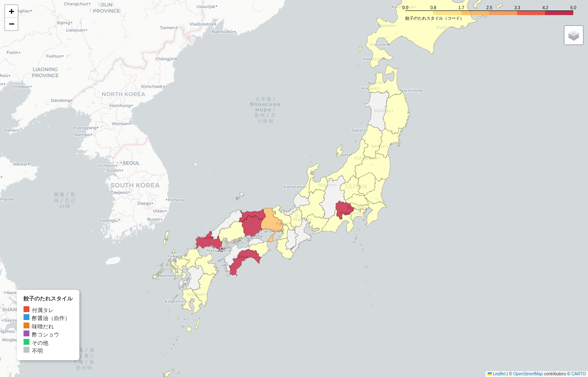

<p align="center">

</p>

## gyoza-tare-map 🥟

> *How does Japan dip its gyoza (dumplings)?*

A data pipeline that automatically discovers, crawls, classifies, and visualizes **regional gyoza condiment culture** across Japan — powered entirely by public web data, zero APIs required.

---

### The Idea

Gyoza (Japanese dumplings) are eaten everywhere in Japan, but *how* people dip them varies dramatically by region. In Kobe, miso-based sauce is the norm. In Tokyo, a self-mixed soy-vinegar blend is typical. Some places use vinegar with black pepper. Some restaurants even recommend eating them plain, without any dipping sauce.

This project maps those regional differences by mining Japanese food blogs and news articles, classifying each article's condiment style, and rendering the result as an interactive choropleth map.

---

### Condiment Labels

| Label | Description |
|-------|-------------|
| `prepared_tare` | Pre-made bottled sauce served by the restaurant |
| `self_mix_soy_vinegar` | DIY soy sauce + vinegar blend at the table |
| `miso_dare` | Miso-based dipping sauce |
| `su_kosho` | Vinegar + black pepper |
| `other_local_style` | Regional variants — yuzu pepper, sesame, etc. |
| `unknown` | No condiment signal detected |

---

### Pipeline



| Stage | What it does |
|-------|-------------|
| **Discover** | Queries はてなブックマーク search RSS (free, no API key) to find gyoza-related URLs per prefecture |
| **Crawl** | Fetches HTML/RSS/JS pages; respects `robots.txt`, enforces 3 s/domain rate limit, caches in SQLite |
| **Extract** | Strips boilerplate with trafilatura; detects prefecture from text; filters non-gyoza articles |
| **Classify** | Keyword-count rule classifier with NFKC normalization; confidence-weighted scoring |
| **Aggregate** | Confidence-weighted label votes per prefecture; flags low-evidence prefectures (< 5 records) |
| **Visualize** | Interactive folium choropleth map saved to `outputs/map.html` |

---

### Quick Start

```bash
# One-time setup
docker compose run --rm app python scripts/fetch_geodata.py
docker compose run --rm app python scripts/discover_seeds.py --all-prefectures --auto-append

# Run the full pipeline
docker compose up app

# Re-aggregate without re-crawling
docker compose run --rm app python scripts/run_pipeline.py --skip-crawl

# Dry run (no file writes)
docker compose run --rm app python scripts/run_pipeline.py --dry-run
```

#### Adding Crawl Targets

`discover_seeds.py` handles this automatically, but manual entries are welcome:

```yaml
# seeds.yaml
sources:
  - type: rss
    url: https://example.com/feed
    prefectures: []             # empty = auto-detect from text

  - type: html
    url: https://example.com/article
    prefectures: ["大阪府"]

  - type: playwright            # for JavaScript-heavy pages
    url: https://example.com/spa
    prefectures: ["兵庫県"]
```

---

### Current Coverage

Pipeline results as of the last run (38 / 47 prefectures):



| Prefecture | Label | Evidence | Notes |
|------------|-------|----------|-------|
| 兵庫県 (Hyogo) | `miso_dare` | 52 | Kobe's miso-sauce culture dominates |
| 東京都 (Tokyo) | `prepared_tare` | 42 | |
| 栃木県 (Tochigi) | `prepared_tare` | 42 | Utsunomiya gyoza capital |
| 大阪府 (Osaka) | `prepared_tare` | 23 | |
| 神奈川県 (Kanagawa) | `prepared_tare` | 18 | |
| 宮崎県 (Miyazaki) | `prepared_tare` | 11 | Surprise #1 gyoza city |
| 福岡県 (Fukuoka) | `prepared_tare` | 7 | |
| 埼玉県 (Saitama) | `prepared_tare` | 6 | |
| 群馬県〜鹿児島県 | `prepared_tare` | 1–5 | Low evidence |

9 prefectures remain uncovered — gyoza tare content is simply sparse online for those regions.

---

### A Note on Survivorship Bias

The near-absence of `self_mix_soy_vinegar` in the results is not evidence that Japanese people rarely mix their own soy-vinegar dip. It is evidence of the opposite: the practice is so unremarkable that no one writes about it.

This pipeline mines food blogs and bookmark-aggregated articles — a corpus dominated by *novelty and recommendation*. A blogger will note "this place serves a house-made miso tare!" precisely because it departs from expectation. The mundane default — grabbing the bottle of vinegar and the bottle of soy sauce already on every table — generates no text signal at all.

The analogy is Abraham Wald's famous WWII analysis of aircraft damage. The Allied forces observed bullet holes concentrated on the wings and fuselage of returning planes and proposed reinforcing those areas. Wald pointed out the flaw: *the planes that were shot in the engines never came back*. The absence of engine damage in the sample was the strongest possible evidence that engines were the critical vulnerability.


*Source: [The Legend of Abraham Wald](https://www.privatdozent.co/p/the-legend-of-abraham-wald), Privatdozent*

In the same way, what this map actually measures is **the noteworthiness of a region's condiment culture**, not its prevalence. `miso_dare` appearing strongly in Hyogo is credible precisely because Kobe-style miso sauce *is* a recognised regional departure. `prepared_tare` dominating everywhere else may reflect nothing more than the fact that house tare is the default expectation — visible in the data only because the name still appears in reviews, not because it is culturally distinctive.

**Practical implication:** adding more web sources would not resolve this bias — it would only compound it. Any corpus built from voluntary text production will systematically silence the unremarkable. To measure default behaviours, one would need data that does not depend on someone choosing to write: surveys, point-of-sale records, or direct observation. This pipeline measures *what people find worth saying about gyoza*, which is a different question entirely.

---

### Classifier Evaluation

Evaluated against a manually labeled test set (`tests/classifier_testset.yaml`, 40 cases):

```
label                     precision    recall        f1  support
----------------------------------------------------------------
prepared_tare                 1.000     1.000     1.000        7
self_mix_soy_vinegar          0.875     1.000     0.933        7
miso_dare                     1.000     1.000     1.000        6
su_kosho                      1.000     1.000     1.000        5
other_local_style             1.000     1.000     1.000        6
unknown                       1.000     0.889     0.941        9
----------------------------------------------------------------
macro avg                     0.979     0.981     0.979       40

Accuracy: 39/40 = 0.975
```

```bash
docker compose run --rm app python scripts/evaluate_classifier.py --verbose
```

---

### Tech Stack

| Layer | Libraries |
|-------|-----------|
| Crawling | `httpx`, `feedparser`, `playwright` |
| Text extraction | `trafilatura` |
| Data | `pandas`, `pyarrow` |
| Geo / Map | `geopandas`, `folium` |
| Search | はてなブックマーク RSS (no API key) |

---


### License

MIT
